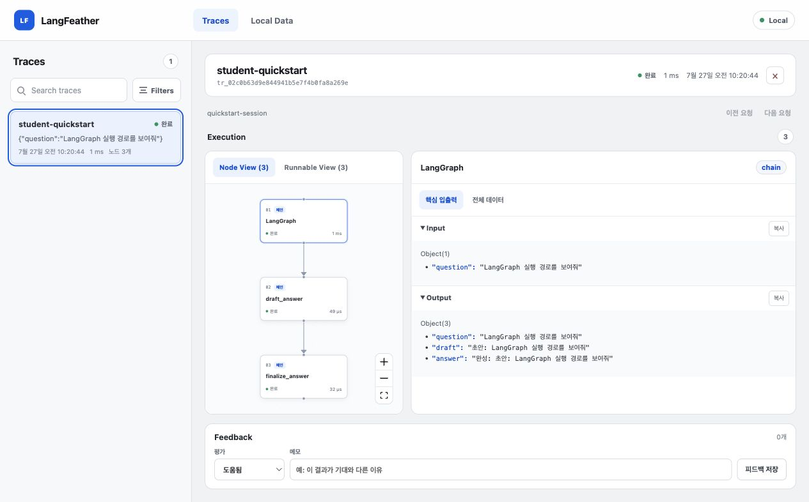
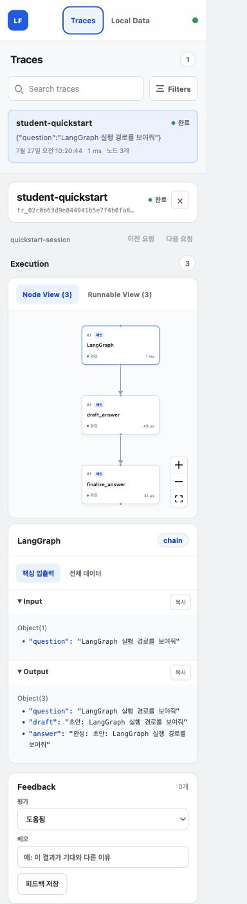

# LangFeather

[한국어 README](README.md)

> **Local-first tracing for Python LangChain and LangGraph projects.**
> Run your application, then inspect the execution path and the original
> input/output of every observed step in a browser on your own computer.

LangFeather is a lightweight tracing tool for users and individual developers
building RAG or agent applications. It keeps the collector, SQLite database,
and UI on the local machine, so you can debug a graph without creating a cloud
account or sending traces to a hosted observability service.



## What you can do

- Wrap a top-level LangChain/LangGraph Runnable with one line and inspect
  callback-visible Runnable, LLM, retriever, and tool calls.
- Compare sequential, parallel, conditional, loop, fallback, streaming, failed,
  and cancelled executions using runnable examples.
- Inspect original diagnostic payloads, including nested JSON, instead of only
  aggregate metrics.
- Add tracing to ordinary Python functions with `@observe` and `span()`, or
  make an ASGI request the root trace with `wrap_asgi()`.
- Navigate traces in the same LangGraph `thread_id`, evaluate them with custom
  scores and a shared trace memo, and manage fixed annotation queues.
- Export a SQLite backup and delete local trace data.

LangFeather displays only runtime relationships supported by captured callback
evidence. It does **not** infer a static graph or unobserved edges.

## Before you start

This is a local, single-user learning and debugging tool. It is not a hosted
service and currently has no login, team sharing, cloud deployment, or
production delivery guarantee.

**Treat stored traces as sensitive.** LangFeather deliberately keeps complete
trace payloads for debugging and does not automatically redact, truncate, or
sample application data. Do not use real secrets or production data in a shared
demo database. The default Docker mapping binds only to `127.0.0.1:4319`.

Local technical gates are complete, but Phase 6 release hardening is still in
progress. A public package release and license decision are not complete. Until
a package release is announced, run examples from a source checkout rather than
assuming `pip install langfeather` is available from PyPI.

The first-release baseline is **0.1.0**. Publication status and changes are in
[CHANGELOG.md](CHANGELOG.md).

## Quick start: see your first trace

### 1. Clone and prepare the development environment

Requirements: Git, Docker Desktop, Python 3.10 or newer, Node.js 24, and
[`uv`](https://docs.astral.sh/uv/).

```bash
git clone https://github.com/SungjinWi99/langfeather.git
cd langfeather
make setup
```

`make setup` installs the project-managed Python 3.12 environment, Python
workspace dependencies, and web dependencies. It may take a few minutes on the
first run.

### 2. Start the local collector and UI

```bash
docker compose up -d --build
```

Open [http://127.0.0.1:4319](http://127.0.0.1:4319). Data is stored in Docker's
`langfeather-data` volume and survives a container restart.

### 3. Run the two-node LangGraph example

In a second terminal, run the example against the Docker collector:

```bash
LANGFEATHER_ENDPOINT=http://127.0.0.1:4319 \
  uv run python examples/langgraph_quickstart/app.py
```

Refresh the browser, select the `quickstart` trace, and click `draft_answer`
then `finalize_answer` to inspect their original input and output.

Stop the local service without deleting data:

```bash
docker compose stop
```

Intentionally remove the container and its local trace volume:

```bash
docker compose down -v
```

## Apply LangFeather to an existing LangGraph project

Start the local collector from this repository:

```bash
docker compose up -d --build
```

For an application running on the host, use `http://127.0.0.1:4319`. For an
application container on the same Docker Compose network, use
`http://langfeather:4319`.

Before a public PyPI release, install the SDK source package through your
project's dependency manager. Replace the GitHub address below with the actual
public address.

```bash
pip install "langfeather[langchain] @ git+https://github.com/SungjinWi99/langfeather.git#subdirectory=sdk/python"
```

Wrap the result of `StateGraph.compile()`—the compiled graph that is actually
called—**once**. Do not change nodes, state schema, prompts, checkpointers,
`thread_id`, existing streaming, or exception handling.

```python
import langfeather

langfeather.configure(endpoint="http://127.0.0.1:4319")
graph = langfeather.wrap_runnable(compiled_graph, name="my-langgraph-app")

result = graph.invoke(
    {"question": "Explain retrieval"},
    {"configurable": {"thread_id": "quickstart-session"}},
)
langfeather.flush(timeout=2)
```

`invoke`, `ainvoke`, `stream`, and `astream` are supported. For streams, pass
through chunks as before and exhaust the iterator. Call `flush()` before a CLI
or script exits when you need to verify trace delivery. Confirm in the UI that
the new trace, root graph, and internal node input/output are visible.

You can give this prompt directly to a coding agent:

```text
Apply LangFeather to my existing LangGraph project.
First locate the StateGraph.compile() result and the real invoke/ainvoke/stream/
astream call site. Wrap the compiled graph that is actually called exactly once
with langfeather.wrap_runnable(). Do not change existing nodes, state schema,
prompts, checkpointers, config, thread_id, streaming, exception handling, or
dependency versions.

The LangFeather endpoint is [http://127.0.0.1:4319 or Docker service address].
Use the existing test or application path to verify that results and streaming
chunks are unchanged, then verify that the UI shows a root graph and at least
one internal node trace. Report changed files, installation and run commands,
verification results, and remaining limitations.
```

See the [Python SDK reference](sdk/python/README.md) for API details. Use
`@langfeather.observe` or `langfeather.span()` for ordinary Python code and
`langfeather.wrap_asgi(app)` for an ASGI application.

## Choose an example

| If you want to inspect… | Start here |
| --- | --- |
| First two-node LangGraph trace | [LangGraph quickstart](examples/langgraph_quickstart/README.md) |
| Parallel branches, loops, fallback, streaming, failure, cancellation | [Runtime fidelity examples](examples/langgraph_runtime_fidelity/README.md) |
| Plain Python functions, spans, and ASGI requests | [Generic capture example](examples/generic_capture/README.md) |
| SDK configuration, stream lifecycle, and serializer behavior | [Python SDK reference](sdk/python/README.md) |
| Local API/database operation | [Server reference](server/README.md) |



## Useful commands

Run these from the repository root after `make setup`:

```bash
make lint            # Python and web lint
make typecheck       # Python and TypeScript type checks
make test            # SDK, server, integration, and web tests
make contract-check  # Confirm generated API schema is committed
make build           # Build both Python packages and the web app
make smoke           # Import and web build smoke checks
```

For a full Docker distribution check (Docker Desktop required):

```bash
bash scripts/container_smoke.sh
```

## Contribution documents

| Document | Use it when… |
| --- | --- |
| [Contributing guide](docs/CONTRIBUTING.md) | you want to report a bug or prepare a focused contribution |
| [Changelog](CHANGELOG.md) | you want to see user-visible changes by release |
| [Release guide](docs/RELEASING.md) | you are preparing a version, tag, or GitHub Release |
| [Product requirements](docs/PRODUCT_REQUIREMENTS.md) | you need the target user, scope, and acceptance criteria |
| [Decisions](docs/DECISIONS.md) | you need to know what is locked or deliberately out of scope |
| [Architecture](docs/ARCHITECTURE.md) | you need SDK/server/web boundaries and runtime flow |
| [Data contract](docs/DATA_CONTRACT.md) | you change trace, observation, score, annotation, or HTTP shapes |
| [Score and annotation queue design](docs/SCORE_ANNOTATION_QUEUE_DESIGN.md) | you need the custom score and annotation queue UX/state rules |
| [Known issues](docs/KNOWN_ISSUES.md) | you are investigating a documented limitation |
| [Agent rules](AGENTS.md) | you are making repository changes with a coding agent |

## Project boundaries

LangFeather v1 intentionally stays small:

- Python SDK only; Python 3.10+
- FastAPI + SQLite + SQLAlchemy + Alembic server
- Vite + React + TypeScript + React Flow UI
- One local Docker container, one Uvicorn worker, and one SQLite writer
- Custom versioned JSON API; no OpenTelemetry in v1
- Best-effort bounded in-memory delivery; no client disk spool

Out of scope: cloud hosting, authentication, multi-project workspaces, a
JavaScript SDK, cost calculation, prompt management, datasets/evaluators, and
automatic payload redaction or retention. See
[docs/DECISIONS.md](docs/DECISIONS.md) for the full rationale.

## Backup and reset

The UI can download a consistent SQLite backup and reset all trace,
observation, score, annotation, memo, and annotation queue data after you type
`RESET`. Backups include raw payloads, so keep them in a safe local location.

Restore is deliberately offline-only. Stop the server first, then mount the
backup directory into the Compose container.

```bash
docker compose stop langfeather
docker compose run --rm --no-deps -v "$PWD:/backup" langfeather \
  langfeather-server restore /backup/langfeather-backup.db
docker compose up -d langfeather
```

The restore command verifies SQLite integrity and migration compatibility before
an atomic replacement, while preserving a safety copy of the previous database.

## Status and roadmap

Phase 0–5 local technical gates are implemented. The next phase is release
hardening: package and image publication, compatibility matrix, clean-install
verification, resource benchmarks, and the final license decision. Detailed
status and acceptance gates are in
[docs/IMPLEMENTATION_PLAN.md](docs/IMPLEMENTATION_PLAN.md).

## License

No open-source license has been selected yet. Before publishing this repository
for reuse, the maintainer must choose and add a `LICENSE`; without one, default
copyright does not grant others permission to reuse or modify the code.
