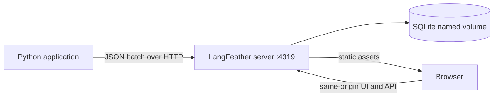
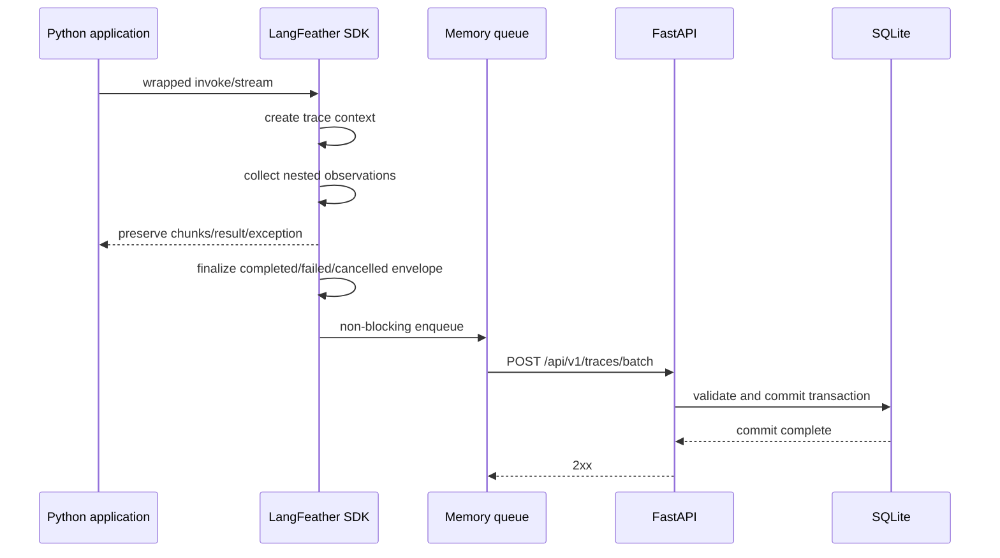

# Architecture

## 1. System Context



LangFeather는 application process 안의 Python SDK와 독립 Docker container
안의 server/UI로 구성된다. Redis, worker service, external database,
object storage는 없다.

## 2. Runtime Components

### Python SDK

SDK는 다음 layer로 나눈다.

```text
public API
├── wrap_runnable
├── wrap_asgi
├── observe
├── span
├── current_context
├── use_context
├── feedback
├── flush
└── shutdown

instrumentation
├── generic function
├── generic ASGI
└── optional LangChain callback

core
├── contextvars trace context
├── in-memory trace builder
├── observation lifecycle
├── serializer registry
└── immutable terminal envelope

transport
├── bounded queue
├── batcher
├── HTTP client
├── retry
└── graceful shutdown
```

Core package는 FastAPI나 LangChain type을 import하지 않는다. optional
integration module이 dependency를 감지하고 명시적인 error message를
제공한다.

### Server

```text
FastAPI
├── ingest router
├── query router
├── feedback router
├── admin backup/reset router
├── validation/domain service
├── SQLAlchemy repositories
├── Alembic migrations
└── static SPA serving
```

Server는 한 process로 실행한다. background worker를 별도 service로
분리하지 않는다. 모든 write는 같은 SQLite database에 transaction으로
commit한다.

### Web

```text
React SPA
├── trace list
├── filters and pagination
├── trace detail
│   ├── execution graph
│   ├── observation summaries
│   └── lazy-loaded node inspector
├── feedback editor
└── settings
    ├── backup
    └── reset
```

Production에서는 Vite build output을 FastAPI가 제공한다. Development에서는
Vite dev server가 `/api`를 FastAPI로 proxy한다.

## 3. Trace Lifecycle



Trace는 실행 container이고 최상위 instrumented operation은 parent가 없는
root observation이다. ASGI wrapper가 있으면 HTTP observation이 root가 되고
runnable은 그 child가 된다.

진행 중 trace를 server에 쓰지 않는다. normal completion, caught exception,
cancellation에서 terminal envelope를 만든다. process hard kill은
best-effort boundary 밖이다.

`stream`과 `astream`은 application chunk를 변경하지 않고 그대로 전달한다.
SDK는 시작된 iterator가 정상 소진되면 `completed`, application exception이면
`failed`, task cancellation이나 `close()`/`aclose()`로 중단되면
`cancelled` terminal envelope를 만든다. callback root가 terminal output을
제공하면 그 값을 보존하고, callback-visible root가 없는 stream만 관찰한
chunk를 순서대로 memory에서 aggregate한다.

## 4. Context and Nesting

현재 trace와 observation stack은 `contextvars`에 저장한다.

- top-level wrapper는 trace를 생성한다.
- nested wrapper는 현재 observation의 child를 생성한다.
- LangChain callback의 run ID와 parent run ID를 observation ID 관계에
  매핑한다.
- child callback이 parent보다 먼저 관찰된 경우 terminal envelope를 만들기
  전에 run ID mapping으로 parent relation을 다시 연결한다.
- async task는 context를 상속하지만 concurrent sibling은 독립 observation
  lifecycle을 가진다.
- ASGI wrapper가 root면 runnable execution은 그 child다.
- active context가 없으면 `@observe` 함수 자체가 root trace가 될 수 있다.

Original function signature, sync/async behavior, iterator/async iterator
semantics를 wrapper가 바꾸면 안 된다.

`@observe`와 `span()`은 같은 generic run stack을 사용한다. `contextvars`가
자동 상속되지 않는 새 thread 등에는 `current_context()` snapshot을
`use_context()` block으로 명시적으로 전달한다. Generator와 async generator는
실제 `next`/`anext`/`close`/`aclose`가 실행되는 동안에만 context를 설치하고
chunk를 caller에게 넘긴 동안에는 context를 해제한다.

Generic run과 LangChain callback run이 번갈아 중첩되면 둘 중 한 stack을
무조건 우선하지 않는다. Generic scope가 시작될 때의 LangChain parent를
anchor로 저장하고, 현재 callback parent가 그 anchor와 같을 때만 더 최근의
generic run을 effective parent로 사용한다. 그 외에는 callback이 제공한
parent를 유지한다. 따라서 `Runnable -> span -> Runnable`과
`span -> Runnable -> span` 모두 실제 lexical call tree를 보존한다. Callback이
제공한 원래 parent ID는 metadata에도 남긴다.

Terminal envelope가 생성된 뒤 inherited context는 더 이상 writable하지 않다.
부모 scope보다 오래 사는 detached task가 이후 관측을 시작하면 이미 전송된
trace에 조용히 누락시키지 않고 새 root trace를 만든다. 같은 trace의 child로
남겨야 하는 task는 부모 scope 안에서 join 또는 await해야 한다.

`wrap_asgi()`는 ambient trace가 있더라도 HTTP request마다 새 root trace를
만든다. request에서는 method, path, query string과 routing field를,
response에서는 status와 body를 best-effort로 수집한다. Cookie,
authorization, `set-cookie`를 포함한 header는 의도적으로 수집하지 않는다.
원본 ASGI message는 변경하지 않으며 `http.disconnect`를 관찰하면
`cancelled`로 종료한다. Exception 또는 disconnect 전에 관찰한 response
status와 body chunk는 failed/cancelled terminal payload에도 보존한다.
Lifespan과 다른 non-HTTP scope는 그대로 통과시킨다.

## 5. Execution Graph Semantics

저장 모델의 기본 관계는 observation당 하나의
`parent_observation_id`다. 이는 runtime call tree를 정확히 나타낸다.

- parent-child는 확실한 callback/context 관계다.
- sibling은 `sequence`와 timestamp로 정렬한다.
- parallelism은 interval overlap으로 표현한다.
- loop와 retry는 동일 name을 가진 별도 observation instance다.
- LangGraph node, step, trigger metadata가 있으면 원문 metadata에 저장한다.
- metadata가 명시적으로 제공하지 않는 data dependency edge는 만들지 않는다.

UI는 React Flow를 사용하지만 제품 의미는 static workflow editor가 아니라
runtime execution inspector다.

## 6. Serialization Pipeline

serializer는 Python value를 JSON-compatible value로 바꾸며 원본 application
object를 복원하는 것이 목적이 아니다.

지원 우선순위:

1. `None`, boolean, number, string
2. dict와 TypedDict-compatible value
3. list, tuple, set
4. Pydantic BaseModel
5. dataclass
6. LangChain Document
7. HumanMessage, AIMessage, SystemMessage, ToolMessage
8. datetime, UUID, Decimal, Enum, Path
9. bytes
10. Exception과 traceback
11. unsupported object type과 safe `repr`

Pydantic v2는 `model_dump(mode="python")` 이후 재귀 변환한다. TypedDict는
runtime에서 일반 dict이므로 별도 class identity를 가정하지 않는다.
arbitrary object의 `__dict__`를 재귀 순회하지 않는다. cycle detection과
depth safety를 구현하되 정상적으로 지원하는 payload를 임의 truncate하지
않는다.

Pydantic, dataclass, LangChain Document/Message는 qualified type과 `fields`
marker를 함께 저장한다. 변환은 Python recursion limit에 의존하지 않는
iterative traversal을 사용한다. 개별 adapter가 실패하면 application 실행을
중단하지 않고 해당 값만 unsupported marker와 bounded safe `repr`로 남긴다.

## 7. Transport

Transport는 application path에서 network I/O를 분리한다.

- completed envelope만 queue에 넣는다.
- queue는 bounded다.
- background sender가 여러 envelope를 batch request로 전송한다.
- transient failure만 짧게 retry한다.
- queue overflow 시 oldest item부터 폐기해 최신 debugging data를 보존한다.
- 정상 shutdown에서는 제한 시간 동안 flush한다.
- 실패는 warning으로 기록하며 application result를 변경하지 않는다.
- disk spool과 guaranteed delivery protocol은 없다.
- batch request의 envelope는 server에서 각각 독립 transaction으로 처리한다.
- 같은 trace ID는 first-write-wins로 duplicate 성공 처리한다.

`flush()`는 호출 시점까지 queue가 수락한 sequence snapshot만 기다린다.
호출 이후 다른 task가 추가한 trace 때문에 기존 flush가 무한히 연장되지
않는다. Shutdown timeout 안에 flush 또는 sender 종료가 끝나지 않으면
warning을 남기고 `False`를 반환하며 application process를 계속 막지 않는다.
Global `shutdown()` 이후에는 lazy sender를 자동 재생성하지 않으며 같은
process에서 다시 수집하려면 `configure()`를 명시적으로 호출한다. Configure와
enqueue가 교차하면 generation을 확인해 retiring sender가 거부한 envelope를
현재 sender에 한 번만 다시 시도한다.

Feedback은 trace envelope와 별도 endpoint로 전송할 수 있다. trace보다 먼저
도착할 수 있으므로 server schema가 순서를 강제하지 않는다.

## 8. Persistence

SQLite 설정:

- named volume path: `/data/langfeather.db`
- WAL journal mode
- `synchronous=FULL`
- foreign keys enabled
- busy timeout configured
- Uvicorn worker count 1

Trace envelope 하나를 transaction 하나에서 trace와 observations와 함께
저장한다. Batch 안의 invalid envelope는 다른 envelope commit을 막지 않는다.
item 결과는 각 commit 후 반환한다. list query에 필요한 scalar field는
column과 index로 저장하고, 원본 payload/metadata는 JSON text로 저장한다.

SQLite file을 실행 중 단순 복사하지 않는다. backup download는 SQLite
online backup API로 consistent snapshot을 만든다. Restore는 server를
중지한 뒤 CLI가 integrity와 migration version을 확인하고 DB file을
교체한다. 실행 중 hot restore와 restore UI는 지원하지 않는다.

## 9. Deployment

Multi-stage Docker build:

1. Node build stage에서 Vite SPA를 build한다.
2. Python build stage에서 server wheel/dependencies를 준비한다.
3. Runtime image에는 Python server, migration, static assets만 포함한다.
4. entrypoint가 migration을 적용하고 Uvicorn single worker를 실행한다.

기본 compose:

```yaml
services:
  langfeather:
    image: ghcr.io/<owner>/langfeather:<version>
    ports:
      - "127.0.0.1:4319:4319"
    volumes:
      - langfeather-data:/data
    environment:
      LANGFEATHER_TRUSTED_HOSTS: localhost,127.0.0.1,langfeather

volumes:
  langfeather-data:
```

Release image는 `linux/amd64`, `linux/arm64`를 대상으로 한다.

## 10. Migration Seams

v1에 구현하지 않지만 다음 seam은 막지 않는다.

- `/api/v1` versioning
- opaque client-generated IDs
- generic observation `kind`
- optional release/environment/tags
- SQLAlchemy repository boundary
- trace-like model을 OTel adapter로 변환할 가능성

이 seam을 이유로 plugin framework, event bus, abstract database dialect를
미리 만들지는 않는다.
