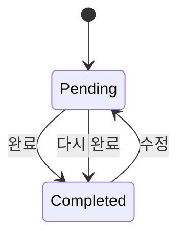

# Score and Annotation Queue Design

## Status

- Product decisions: user-aligned on 2026-07-28
- Implementation: implemented on `dev/wiggle`
- Contract status: synchronized with product, architecture, and data contracts

이 문서는 custom score, trace annotation, trace memo, annotation queue를
구현하기 전에 합의한 설계 기준과 현재 구현의 사용자 상태 규칙을 기록한다.
정확한 HTTP/database contract는 `DATA_CONTRACT.md`를 따른다.

## 1. Goal

현재 trace detail의 고정 `도움됨/아쉬움 + 메모` feedback UI를 다음 workflow로
교체한다.

1. 사용자가 `Scores`에서 custom score를 정의한다.
2. Trace detail에서 score를 기록하고 trace 공통 메모를 작성한다.
3. 사용자가 검토할 trace를 고정 목록인 annotation queue에 명시적으로 추가한다.
4. Queue마다 사용할 score를 선택한다.
5. 사용자가 queue의 trace를 검토한 뒤 명시적으로 완료한다.
6. 완료된 trace를 수정하면 해당 queue item이 미완료로 돌아가고, 다시 완료할
   때 완료 상태로 복귀한다.

이 기능은 local-first, single-project, single-user 경계를 유지한다. Dataset,
experiment runner, evaluator, multi-reviewer agreement 기능을 함께 추가하지
않는다.

## 2. Locked Product Decisions

### 2.1 Annotation Target

- 첫 구현은 trace 전체 annotation만 지원한다.
- UI와 API는 `target_type=trace`만 수용한다.
- 저장 모델은 향후 observation annotation을 추가할 때 기존 annotation을
  옮기지 않도록 `target_type`, `target_id`, owning `trace_id`를 보존한다.
- Observation annotation UI, validation, queue item은 첫 구현 범위 밖이다.

### 2.2 Score Types

첫 구현은 다음 세 타입만 지원한다.

| Type | Configuration | Stored value |
| --- | --- | --- |
| `boolean` | 사용자 지정 true/false label | boolean |
| `number` | optional minimum/maximum | finite number |
| `categorical` | ordered options, `single` 또는 `multiple` | selected option IDs |

- Free-text/string score는 지원하지 않는다.
- 자유 서술은 별도의 trace memo에 저장한다.
- 새 database에는 기본 score를 자동 생성하지 않는다.
- 빈 `Scores` 화면에서 생성 예시로 `Success` boolean, `Failure Type`
  categorical multiple, `Quality` number를 안내할 수 있다. 예시는 실제
  score record가 아니다.

### 2.3 Categorical Multiple

- `categorical/multiple`의 빈 선택 `[]`은 유효한 annotation 값이다.
- Annotation record가 없는 상태와 빈 선택을 저장한 상태를 구분한다.
- System이 `None`, `해당 없음` option을 자동 생성하지 않는다.
- `None`이 분석상 별도 category여야 하면 사용자가 직접 option을 생성한다.
- Option 선택 순서는 값의 의미에 포함하지 않는다.
- 같은 option은 한 annotation에서 한 번만 선택할 수 있다.

### 2.4 Trace Memo

- Trace마다 자유 텍스트 memo 하나를 둘 수 있다.
- Memo는 특정 score나 queue에 속하지 않는다.
- 같은 trace가 여러 queue에 있어도 score와 memo는 공유한다.
- Memo 작성 여부는 queue 완료 조건이 아니다.

### 2.5 Fixed Annotation Queue

- Queue item은 사용자가 명시적으로 추가한 trace의 고정 목록이다.
- Status, tag, query에 맞는 새 trace를 자동으로 추가하는 dynamic queue는
  지원하지 않는다.
- 사용자는 queue 생성 뒤에도 trace를 명시적으로 추가하거나 제거할 수 있다.
- Queue마다 표시할 score config를 명시적으로 선택한다.
- 새 score가 생겨도 기존 queue에 자동으로 추가되지 않는다.
- Queue의 score 목록도 사용자가 명시적으로 추가하거나 제거할 수 있다.
- 같은 trace가 여러 queue에 들어갈 수 있다.

### 2.6 Queue Completion

Queue 완료는 score 값이나 memo 작성률로 계산하지 않고 사용자의 명시적
동작으로만 결정한다.



- `pending` item의 score와 memo는 편집 가능하다.
- `완료`는 현재 form의 annotation과 memo를 저장하고 queue item을
  `completed`로 바꾼다.
- Score가 없거나 categorical multiple이 `[]`이어도 완료할 수 있다.
- `completed` item은 읽기 전용으로 표시한다.
- `수정`을 누르는 즉시 현재 queue item만 `pending`으로 바꾸고 기존 값은
  유지한 채 편집을 활성화한다.
- 수정 취소를 위한 별도 상태는 두지 않는다. 다시 `완료`해야 completed로
  돌아간다.
- 같은 trace가 들어 있는 다른 queue item의 상태는 바꾸지 않는다.
- Traces 화면에서 score나 memo를 수정해도 queue 상태를 자동 변경하지 않는다.
- Annotation 저장과 queue 완료 상태 변경은 하나의 server transaction으로
  처리한다.

Queue 화면은 탐색을 위해 `완료 4 / 10`, pending/completed filter를 제공할 수
있다. 이를 품질 KPI로 표현하지 않으며 별도의 score 작성률 metric은 만들지
않는다.

### 2.7 Score Lifecycle

- 아직 annotation에 사용되지 않은 score는 구조를 수정하거나 삭제할 수 있다.
- 한 번이라도 사용된 score는 표시 이름과 설명만 수정할 수 있다.
- 사용된 score의 type, categorical selection mode, number range는 변경할 수
  없다.
- 사용된 categorical option의 identity와 의미를 바꾸거나 hard-delete하지
  않는다.
- 사용을 중단한 score와 option은 archive한다.
- 의미가 달라지면 기존 record를 변경하지 않고 새 score 또는 option을 만든다.
- Archived score와 option으로 작성된 기존 annotation은 계속 조회할 수 있다.

### 2.8 Legacy Feedback

- 기존 feedback은 테스트용 dummy data이므로 보존하거나 새 annotation으로
  변환하지 않는다.
- Migration은 legacy feedback data와 table을 제거할 수 있다.
- `/api/v1/feedback`과 고정 feedback UI는 새 Score/Annotation contract로
  교체한다.
- 이 변경은 HTTP API 호환성 변경이지만 trace envelope의
  `schema_version=1`은 변경하지 않는다.

## 3. Proposed Domain Model

### 3.1 Score Config

```text
score_configs
- score_config_id
- name
- description
- data_type: boolean | number | categorical
- boolean_true_label
- boolean_false_label
- number_min
- number_max
- categorical_selection_mode: single | multiple
- created_at
- updated_at
- archived_at
```

Type별로 사용하지 않는 configuration column은 null이다. Server는 config를
생성하거나 수정할 때 type에 맞는 조합과 finite number range를 검증한다.
Active score name은 UI에서 구분할 수 있도록 중복을 허용하지 않는다. Identity와
annotation relation에는 mutable name이 아니라 opaque `score_config_id`를
사용한다.

### 3.2 Categorical Option

```text
score_options
- score_option_id
- score_config_id
- label
- position
- created_at
- updated_at
- archived_at
```

Option은 stable opaque ID를 사용한다. Annotation은 label이 아니라 option ID를
참조한다. 응답과 UI는 `position`으로 정렬한다.

### 3.3 Annotation

```text
annotations
- annotation_id
- score_config_id
- target_type
- target_id
- trace_id
- boolean_value
- number_value
- created_at
- updated_at

annotation_selected_options
- annotation_id
- score_option_id
```

Invariants:

- 현재 API에서는 `target_type=trace`, `target_id=trace_id`만 허용한다.
- `(score_config_id, target_type, target_id)`는 unique다.
- Boolean annotation은 boolean value 하나만 가진다.
- Number annotation은 configured range 안의 finite number 하나만 가진다.
- Categorical annotation은 scalar value column을 사용하지 않는다.
- Categorical single은 정확히 option 하나를 가진다.
- Categorical multiple은 option을 0개 이상 가진다.
- `(annotation_id, score_option_id)`는 unique다.
- 선택 option은 annotation의 score config에 속해야 한다.
- API는 archived option을 새로 선택하는 write를 거부하지만 기존 annotation의
  archived option reference는 조회할 수 있어야 한다.
- Multiple selection update는 한 transaction에서 전체 선택 집합을 교체한다.

`trace_id`는 현재 trace target에서는 `target_id`와 중복되지만, 향후
observation target의 owning trace 조회와 trace 삭제 정리를 위해 명시적으로
보존한다.

### 3.4 Trace Memo

```text
trace_memos
- trace_id primary key
- content
- created_at
- updated_at
```

빈 문자열은 memo 삭제와 동일하게 처리한다. Memo는 score와 queue lifecycle에
영향을 주지 않는다.

### 3.5 Annotation Queue

```text
annotation_queues
- annotation_queue_id
- name
- description
- created_at
- updated_at

annotation_queue_scores
- annotation_queue_id
- score_config_id
- position

annotation_queue_items
- annotation_queue_item_id
- annotation_queue_id
- trace_id
- status: pending | completed
- created_at
- updated_at
- completed_at
```

Invariants:

- `(annotation_queue_id, score_config_id)`는 unique다.
- `(annotation_queue_id, trace_id)`는 unique다.
- 완료 상태는 annotation 존재 여부에서 derive하지 않고 저장한다.
- `pending`이면 `completed_at=null`이다.
- `completed`이면 `completed_at`이 존재한다.

## 4. UX Structure

Top navigation은 다음 네 영역으로 구성한다.

```text
Traces | Annotation Queues | Scores | Local Data
```

### 4.1 Scores

- Active/archived score 목록
- Score 생성
- Type별 configuration form
- 사용 전 구조 수정 및 삭제
- 사용 후 이름/설명 수정과 archive
- 빈 화면에는 실제 record를 만들지 않는 `Success`, `Failure Type`,
  `Quality` 예시

### 4.2 Traces

기존 execution graph와 inspector flow를 유지하고 trace detail에 다음을
추가한다.

- 빈 `Annotation` 영역의 `Add scores`와 trace memo
- 사용자가 trace별로 추가한 score annotation form
- 하나 이상의 queue에 trace 추가
- Trace가 속한 queue와 해당 item 상태 확인 및 queue로 이동

Traces에서 score나 memo를 수정하는 행위는 어느 queue도 자동으로 pending으로
바꾸지 않는다.

### 4.3 Annotation Queues

- Queue 목록과 pending/completed item 수
- Queue 생성 시 이름, 설명, 사용할 score 선택
- Trace 검색/선택을 통한 명시적 item 추가
- Queue detail의 trace sidebar와 pending/completed filter
- 기존 trace graph/inspector를 재사용하는 review workspace
- Pending item의 편집 가능한 score/memo form과 `완료`
- Completed item의 읽기 전용 score/memo와 `수정`

Queue 삭제는 queue definition, score membership, item status만 제거한다.
Trace score와 memo는 삭제하지 않는다.

## 5. Deletion and Reset Semantics

- Trace 삭제는 observations, annotations, selected option relation, memo,
  모든 queue item을 함께 삭제한다.
- Queue에서 trace 제거는 해당 queue item 상태만 삭제한다.
- Queue 삭제는 trace, annotation, memo를 삭제하지 않는다.
- 아직 사용되지 않은 score hard-delete는 그 option을 함께 삭제한다.
- 사용된 score와 option은 hard-delete하지 않고 archive한다.
- Full reset은 traces와 함께 score configs, options, annotations, memos,
  queues를 포함한 product data를 모두 삭제한다.
- Backup과 restore는 새 table을 SQLite snapshot에 그대로 포함한다.

## 6. API Surface

Route naming은 test와 함께 고정한다. 필요한 resource 경계는
다음과 같다.

```text
GET    /api/v1/scores
POST   /api/v1/scores
GET    /api/v1/scores/{score_config_id}
PATCH  /api/v1/scores/{score_config_id}
DELETE /api/v1/scores/{score_config_id}
POST   /api/v1/scores/{score_config_id}/archive

PUT    /api/v1/traces/{trace_id}/annotations/{score_config_id}
DELETE /api/v1/traces/{trace_id}/annotations/{score_config_id}

PUT    /api/v1/traces/{trace_id}/memo
DELETE /api/v1/traces/{trace_id}/memo

GET    /api/v1/annotation-queues
POST   /api/v1/annotation-queues
GET    /api/v1/annotation-queues/{queue_id}
PATCH  /api/v1/annotation-queues/{queue_id}
DELETE /api/v1/annotation-queues/{queue_id}

POST   /api/v1/annotation-queues/{queue_id}/items
DELETE /api/v1/annotation-queues/{queue_id}/items/{item_id}
POST   /api/v1/annotation-queues/{queue_id}/items/{item_id}/edit
POST   /api/v1/annotation-queues/{queue_id}/items/{item_id}/complete
```

`complete` request는 현재 form의 annotation과 memo 변경을 함께 받을 수 있어야
하며 server는 값 저장과 item status 변경을 하나의 transaction으로 commit한다.

## 7. Compatibility and Migration

- 새 Alembic revision에서 score, option, annotation, memo, queue table을
  생성한다.
- Legacy feedback table과 data는 같은 migration에서 제거할 수 있다.
- Legacy feedback canonical fixture, server contract, web types와 tests는 새
  resources로 교체한다.
- Trace/observation terminal envelope는 변경하지 않는다.
- 따라서 trace ingest `schema_version=1`은 유지한다.
- SDK tracing runtime과 transport에는 새 annotation 기능을 넣지 않는다.
  Annotation은 local server/UI workflow다.
- API 제거와 UI 변경에 맞춰 product SemVer와 changelog를 갱신한다.

## 8. Out of Scope

- Observation/node-level annotation UI와 queue item
- Dynamic query/filter queue
- Queue assignment, reviewer identity, multi-user workflow
- Inter-annotator agreement와 approval workflow
- Required score와 score completion validation
- Score 작성률 또는 annotation productivity dashboard
- System-created `None` category
- String/text score
- Dataset, experiment runner, evaluator와 LLM judge
- Server-side user code execution
- Scheduler, worker, broker

## 9. Acceptance Criteria

1. 새 database의 `Scores`가 비어 있고 `Success`, `Failure Type`,
   `Quality` 생성 예시만 안내한다.
2. Boolean, bounded/unbounded number, categorical single/multiple score를
   생성할 수 있다.
3. Categorical multiple annotation에 option 여러 개 또는 `[]`를 저장하고
   다시 조회할 수 있다.
4. Trace마다 score별 현재 annotation 하나와 공통 memo 하나를 작성·수정·삭제할
   수 있다.
5. 고정 trace 목록과 선택된 score 목록으로 queue를 만들 수 있다.
6. 새 trace와 새 score가 기존 queue에 자동 추가되지 않는다.
7. Score가 비어 있어도 사용자가 queue item을 완료할 수 있다.
8. Completed item에서 `수정`을 누르면 그 item만 pending이 되고 기존 값은
   유지된다.
9. 다시 `완료`하면 annotation/memo 저장과 completed 상태가 같은 transaction에
   commit된다.
10. Trace가 여러 queue에 있을 때 한 queue의 수정 상태가 다른 queue 상태를
    바꾸지 않는다.
11. 사용된 score 구조 변경과 hard-delete를 거부하고 archive는 허용한다.
12. Queue 삭제는 trace annotation과 memo를 보존하고 trace 삭제는 관련
    annotation, memo, queue item을 제거한다.
13. Existing trace ingest fixture와 `schema_version=1` contract가 그대로
    통과한다.
14. Desktop과 mobile에서 score 관리, queue 탐색, annotation 수정과 완료가
    가능하다.

## 10. Implementation Order

구현은 아래 순서로 진행했다.

1. Authority 문서와 public API breaking-change 기록 갱신
2. Server focused failing tests와 Alembic migration
3. Score config/option repository와 API
4. Trace annotation/memo repository와 API
5. Fixed queue repository, state transition, atomic complete API
6. Shared web types와 API client
7. `Scores` UI
8. Trace annotation/memo UI
9. `Annotation Queues` review workspace
10. Cross-package integration, browser smoke, backup/reset/restore regression
11. README, changelog, migration note 갱신

Required gates:

```text
make lint
make typecheck
make test
make contract-check
make build
make smoke
bash scripts/container_smoke.sh
```
